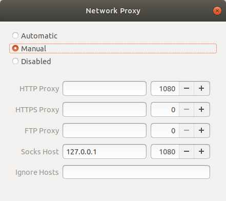

Windows 、Android、iOS都有比较成熟的GUI客户端实现shadowsocks穿墙，并且支持PAC和全局上网。Ubuntu上试用的客户端有3种，见下，配置流程比其他OS要复杂。

> 1. shadowsocks
> 2. shadowsocks-qt5
> 3. electron-ssr

其中，

1. shadowsocks在ubuntu上不区分server和client，没有GUI
2. shadowsocks-qt5有GUI，但基本版本不支持chacha20-ietf-poly1305加密协议，网上有人在原有基础上添加了该加密协议（https://www.shangyexin.com/2018/04/20/shadowsocks-qt5/ ）
3. electron-ssr有GUI，支持chacha20-ietf-poly1305加密协议 在github上的项目被作者删除，不明原因。但网上有backup（https://github.com/qingshuisiyuan/electron-ssr-backup）

本文采用shadowsocks-qt5，并配置Chrome和Terminal，实现科学上网。

# 安装shadowsocks-qt5

shadowsocks-qt5 （简称ss-qt5）需要通过PPA源安装，仅支持Ubuntu 14.04或更高版本。

设置 PPA 源并安装 shadowsocks-qt5

```shell
sudo add-apt-repository ppa:hzwhuang/ss-qt5
sudo apt-get update
sudo apt-get -f install libappindicator1 libindicator7
sudo apt-get install shadowsocks-qt5
```

如果有报错的话运行

```shell
sudo vim /etc/apt/sources.list.d/hzwhuang-ubuntu-ss-qt5-bionic.list
```

将修改bionic为xenial


```shell
deb http://ppa.launchpad.net/hzwhuang/ss-qt5/ubuntu bionic main
deb http://ppa.launchpad.net/hzwhuang/ss-qt5/ubuntu xenial main
```


# 配置Chrome

ss连上之后，chrome无法上网，还要设置Ubuntu的网络代理。点击Settings->Network->Network Proxy->Manual，进行如下配置：



此时，Chrome已可上网。

## 添加ss至开机启动

为了方便，可以将Shadowsocks添加到开机启动，执行下面的命令：

```shell
gnome-session-properties
```

弹出的对话框中点击**Add**，添加ss-qt5的启动项，例如：

```shell
Name: shadowsocks-qt5
Command: /usr/bin/ss-qt5
Comment: shadowsocks-qt5
```

# 配置Terminal

配置了系统的全局代理，但Terminal还是无法穿墙。
因为，Terminal只支持http、https协议，而ShadowSocks使用的是socks协议
如何规避，可以使用**Privoxy**来将http和socks相互转换。

> Privoxy是一款带过滤功能的代理服务器，针对HTTP、HTTPS协议。通过Privoxy的过滤功能，用户可以保护隐私、对网页内容进行过滤、管理cookies，以及拦阻各种广告等。Privoxy可以用作单机，也可以应用到多用户的网络。
> 修改HTTP请求头的字段，如referrer和user agent，从而隐藏用户上一个查看的网页和用户正在使用的浏览器

## 安装Privoxy

使用下面的命令安装Privoxy：

```shell
sudo apt-get install privoxy
```

## 配置Privoxy

安装完毕后，打开Privoxy的配置文件/etc/privoxy/config（配置文件非常大）:

```shell
sudo vim /etc/privoxy/config
```

首先，定位 **4.1. listen-address** 这一节，找到监听的端口，通常是8118：

```shell
#        listen-address  192.168.0.1:8118
#
#      Suppose you are running Privoxy on an IPv6-capable machine and
#      you want it to listen on the IPv6 address of the loopback
#      device:
#
#        listen-address [::1]:8118
#
listen-address  127.0.0.1:8118
listen-address  [::1]:8118
#
#  4.2. toggle
#  ============
#
#  Specifies:
#
#      Initial state of "toggle" status

```

接着，在 **5.2. forward-socks4, forward-socks4a, forward-socks5 and forward-socks5t** 这一节，加上如下配置，注意最后有一个点号"     **.**":

```shell
#        forward           127.*.*.*/     .
#
#      Unencrypted connections to systems in these address ranges
#      will be as (un)secure as the local network is, but the
#      alternative is that you can't reach the local network through
#      Privoxy at all. Of course this may actually be desired and
#      there is no reason to make these exceptions if you aren't sure
#      you need them.
#
#      If you also want to be able to reach servers in your local
#      network by using their names, you will need additional
#      exceptions that look like this:
#
#       forward           localhost/     .
#
forward-socks5 / 127.0.0.1:1080 .
#
#  5.3. forwarded-connect-retries
```

保存后，重启Privoxy:

```shell
sudo /etc/init.d/privoxy restart
```

接着配置终端的环境，打开终端配置文件:

```shell
sudo vim ~/.bashrc
```

在末尾追加 **http_proxy** 和 **https_proxy**：

```shell
# enable programmable completion features (you don't need to enable
# this, if it's already enabled in /etc/bash.bashrc and /etc/profile
# sources /etc/bash.bashrc).
if ! shopt -oq posix; then
  if [ -f /usr/share/bash-completion/bash_completion ]; then
    . /usr/share/bash-completion/bash_completion
  elif [ -f /etc/bash_completion ]; then
    . /etc/bash_completion
  fi
fi

# add by XXX for termimal proxy 2020-02-06
export http_proxy="127.0.0.1:8118"
export https_proxy="127.0.0.1:8118"
```

保存文件后，重启终端或者执行下面的命令重新读取配置文件：

```shell
source ~/.bashrc
```

测试穿墙是否成功：

```
~$ wget http://www.google.com
ww.google.com
--2020-02-06 11:51:29--  http://www.google.com/
Connecting to 127.0.0.1:8118... connected.
Proxy request sent, awaiting response... 200 OK
Length: 11986 (12K) [text/html]
Saving to: ‘index.html’

index.html        100%[===================>]  11.71K  --.-KB/s    in 0s      

2020-02-06 11:51:29 (89.4 MB/s) - ‘index.html’ saved [11986/11986]
```

到这里，就实现了Terminal的穿墙。

## Pivoxy添加开机启动

可将Privoxy添加到开机启动，ubuntu18.04 没有/etc/rc/local，需要自己手动添加

```shell
sudo vim /lib/systemd/system/rc.local.service
```

一般启动文件由三个部分组成：

> [Unit]段: 启动顺序与依赖关系
>
> [Service] 段: 启动行为,如何启动，启动类型
>
> [Install] 段: 定义如何安装这个配置文件，即怎样做到开机启动

rc.local.service中缺少[Install]，手动添加进去

```
[Install]  
WantedBy=multi-user.target  
Alias=rc-local.service
```

创建 /etc/rc.local，将需要启动的命令加入其中

```shell
#!/bin/sh -e
#
# rc.local
#
# This script is executed at the end of each multiuser runlevel.
# Make sure that the script will "exit 0" on success or any other
# value on error.
#
# In order to enable or disable this script just change the execution
# bits.
#
# By default this script does nothing.

sudo /etc/init.d/privoxy start
exit 0
```

给rc.local加可执行权限

```shell
sudo chmod +x /etc/rc.local
```

systemd 默认读取 /etc/systemd/system 下的配置文件, 所以还需要在 /etc/systemd/system 目录下创建软链接

```shell
sudo ln -s /lib/systemd/system/rc.local.service /etc/systemd/system/
```
