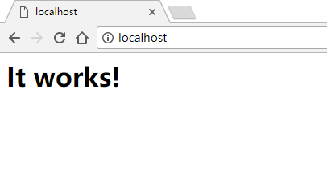
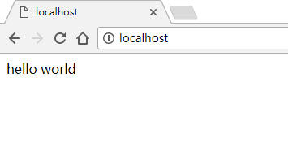

本文介绍Apache+PHP+MySQL的安装与部署。

> OS：Windows10
>
> Apache：2.4.41（httpd-2.4.41-win64-VS16）
>
> PHP：5.6.9（php-5.6.9-Win32-VC11-x64）
>
> MySQL：8.0.17（mysql-installer-community-8.0.17.0）

# PHP安装&配置

1. 将php-5.6.9-Win32-VC11-x64.zip解压到任意目录，例如 E:/php5

2. 配置php

   在 E:/php5/路径下，复制php.ini-production，并重命名为php.ini

   ```shell
   # 修改文件 E:/php5/php.ini
   # 设置库路径
   extension_dir = "D:/php5/ext"
   # 根据自己的需求，添加用到的库，通常会用到curl,mysql,mbstring, mysql下面第三节再讲
   extension=php_mbstring.dll
   extension=php_curl.dll
   ```

# Apache安装&配置

1. 将httpd-2.4.41-win64-VS16.zip解压到任意目录，例如 E:/Apache24。

2. 修改配置项：

   ```shell
   # 修改文件 E:/Apache24/conf/httpd.conf
   # 设置Apache目录
   line 37： Define SRVROOT "E:/Apache24"
   # 去掉注释
   line 162: LoadModule rewrite_module modules/mod_rewrite.so
   line 183: LoadModule vhost_alias_module modules/mod_vhost_alias.so
   # 设置php5 module的路径
   line 186: LoadModule php5_module E:/php5/php5apache2_4.dll
   # 设置php type，在<IfModule mime_module></IfModule>中间添加
   AddType application/x-httpd-php .php
   AddType application/x-httpd-php-source .phps
   # 设置Apache支持的文件
   <IfModule dir_module>
       DirectoryIndex index.html index.php
   </IfModule>
   # 配置文件最后，添加php.ini的路径
   PHPIniDir "E:/php5"
   ```

3. 安装Apache

   以管理员方式打开cmd命令窗口，进入路径 E:/Apache24/bin，执行安装命令：

   ```shell
   D:\Apache24\bin>httpd.exe -k install
   Installing the 'Apache2.4' service
   The 'Apache2.4' service is successfully installed.
   Testing httpd.conf....
   Errors reported here must be corrected before the service can be started.
   AH00558: httpd.exe: Could not reliably determine the server's fully qualified domain name, using fe80::5414:70d8:84aa:48c7. Set the 'ServerName' directive globally to suppress this message
   ```

   会有一个*ServiceName* 的报错，重新打开httpd.conf

   ```shell
   # 修改文件 E:/Apache24/conf/httpd.conf
   # 将ServiceName改为本地地址
   ServerName localhost:80
   ```

   更改完后运行测试命令，安装成功。

   ```shell
   D:\Apache24\bin>httpd -t
   Syntax OK
   ```

   Apache的常用命令：

   ```shell
   httpd -k install
   httpd -k uninstall
   httpd -t
   httpd -k start
   httpd -k restart
   httpd -k stop
   ```

# MySQL安装&配置

1. 安装

   双击安装程序**mysql-installer-community-8.0.17.0.msi**，一路向下，MySQL的安装包中集成了很多功能，这里只需选择MySQL server安装即可。

2. 配置

   **配置系统环境变量**

   在系统环境变量中加入变量MySQL的安装路径：

   |    变量    |                   值                    |
   | :--------: | :-------------------------------------: |
   | MYSQL_HOME | C:\Program Files\MySQL\MySQL Server 8.0 |

   

   再在变量**Path**中加入MySQL的bin文件路径

   ```
   %MYSQL_HOME%\bin
   ```

   **修改php配置文件**

   在php.ini中加入MySQL的相关配置

   ```shell
   # 修改文件 E:/php5/php.ini
   # 添加mysql库
   extension=php_mysql.dll
   extension=php_mysqli.dll
   extension=php_pdo_mysql.dll
   ```

   **修改MySQL配置文件**

   PHP5.7连MySQL8.0会因为密码机制问题报错，可以在配置文件my.ini中更改认证的密码机制 或者命令更改登录用户的认证机制

   ***配置文件中更改认证机制***

   my.ini通常的存放地址为 *C:\ProgramData\MySQL\MySQL Server 8.0*

   ```shell
   -default_authentication_plugin=caching_sha2_password
   +default_authentication_plugin=mysql_native_password
   ```

   ***更改已有账户的认证设置***

   ```mysql
   ALTER USER 'native'@'localhost' IDENTIFIED WITH mysql_native_password BY 'new_password';
   ```

   或

   ```mysql
   ALTER USER 'native'@'localhost' IDENTIFIED WITH mysql_native_password;
   ALTER USER USER() IDENTIFIED BY 'new_password';
   ```

# 运行Apache

1. 启动Apache

   双击运行 *D:/Apache24/bin/ApacheMonitor.exe* 界面程序，点击 **start** 可启动

   或者通过Apache的命令行命令启动（start/restart/stop）

   启动之后，浏览器中打开地址 *localhost*，见下：

   

   

   Apache的本地网页根目录可在配置文件httpd.conf中设置：

   ```shell
   # E:/Apache24/conf/httpd.conf
   DocumentRoot "${SRVROOT}/htdocs"
   <Directory "${SRVROOT}/htdocs">
   ```

   

   > NOTE：此网页在Apache默认根目录路径 ***D:\Apache24\htdocs\index.html***


2. 支持PHP

    Apache默认支持html，需要在配置文件httpd.conf中对PHP进行设置，在**Apache安装&配置** 一节中已经添加。（**AddType**和**DirectoryIndex**）。

    将D:\Apache24\htdocs\index.html 改为index.php，并改动其内容

    ```php
    <?php echo "hello world"; ?>
    ```

    浏览器上打开localhost正常情况下，会显示hello word字样，但有可能有如下错误：

    ```
    not function curl_init php        
    ```

    这是因为Apache没有找到对应的php curl导致，在D:/php目录下，找到**libeay32.dll**, **libssh2.dll**, **ssleay32.dll**，复制到D:/Apache/bin/下。

    > PHP在Apache上运行，Apache查找的库路径是<apache dir>，而非<php dir>

    restart Apache，打开 *http://localhost*

    

    

    如果需要部署自己的网页，更改DocumentRoot的值即可，例如：

    ```shell
    DocumentRoot "D:/www"
    <Directory "D:/www">
    ```

  


至此，Apache+PHP+MySQL的部署已全部完成。